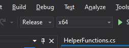
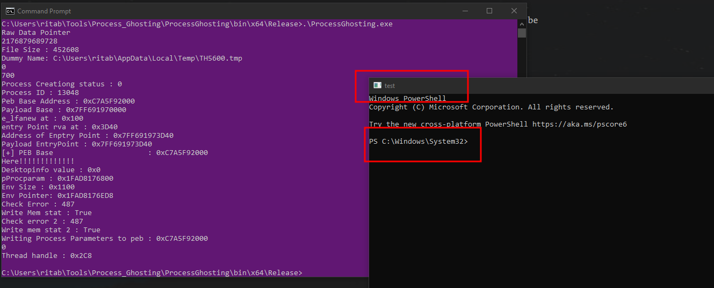

# ProcessGhosting
This is a C# implementation of the original Process Ghosting written in C [Original POC](https://github.com/hasherezade/process_ghosting). 

For easier understanding, the target file name and path have been hardcoded. 

## Usage

- Open the project solution in Visual Studio
- Change the path of the target binary that you want to run in the following lines

```cs
string filename = @"C:\Windows\System32\WindowsPowerShell\v1.0\powershell.exe"; //Change this
```

- Compile the code in Visual Studio as Release and in x64 architecture 



- Run the `ProcessGhosting.exe` program to launch a target binary of your choice

```
./ProcessGhosting.exe
```




**For More details about this technique refer to my [Blog](https://dosxuz.gitlab.io/post/processghosting/)**
